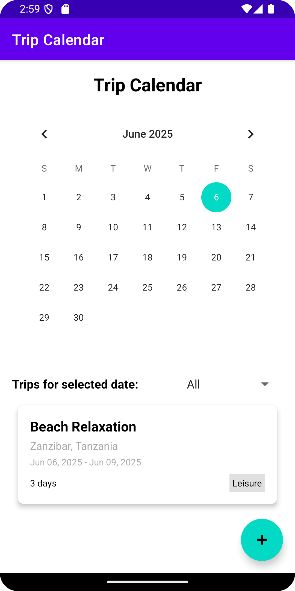
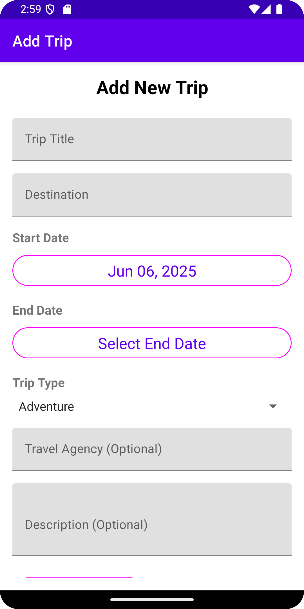
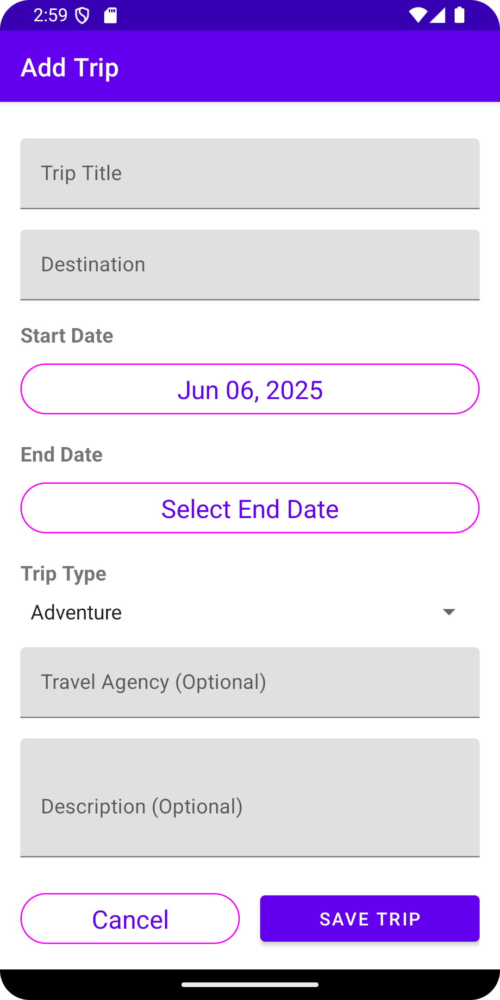

# TripBook
TripBook: A mobile social network for travelers exploring Africa &amp; beyond. Share stories, photos, and tips, rate travel agencies, and connect with adventurers. Community-driven platform to discover hidden gems, promote tourism, and ensure safer journeys. Built with React Native, Node.js &amp; geolocation APIs. Contributions welcome! 🌍✨

## Screenshots

### Trip Calendar Feature

| Calendar View                           | Add Trip Form                      | Trip List                           |
|-----------------------------------------|------------------------------------|-------------------------------------|
|  |  |  |

*Note: Place your trip calendar screenshots in the `screenshots/` folder to display them above.*

## Trip Calendar Implementation

### Features Implemented:
- **TripCalendarActivity**: Shows all upcoming trips on a calendar view
- **AddTripActivity**: Add new trips for any selected date
- **SQLite Database**: Uses local SQLite database to store trip data
- **Calendar View**: MaterialDatePicker/CalendarView for date selection
- **Trip Filtering**: Filter trips by duration (1, 3, 7 days) or type (Adventure, Leisure, Business)
- **RecyclerView**: Display trips starting on selected date
- **FloatingActionButton**: Quick access to add new trips
- **Form Validation**: Proper validation for required fields
- **Date Picker**: Easy date selection with validation
- **Sample Data**: Pre-populated with sample trips for testing

### Files Created:

1. `TripCalendarActivity.kt` - Main calendar activity with FAB
2. `AddTripActivity.kt` - Form activity to add new trips
3. `Trip.kt` - Data class for trip information
4. `TripDatabaseHelper.kt` - SQLite database helper
5. `TripAdapter.kt` - RecyclerView adapter for trip list
6. `activity_trip_calendar.xml` - Layout for calendar activity with FAB
7. `activity_add_trip.xml` - Form layout for adding trips
8. `item_trip.xml` - Layout for individual trip items

### How to Use:
1. Launch the app
2. Click "Open Trip Calendar" button
3. Select a date on the calendar to view trips for that date
4. Click the **➕ (Plus)** FloatingActionButton to add a new trip
5. Fill in the trip details:
    - Trip Title (required)
    - Destination (required)
    - Start Date (auto-filled with selected calendar date)
    - End Date
    - Trip Type (Adventure, Leisure, Business, Cultural, Medical, Educational)
    - Travel Agency (optional)
    - Description (optional)
6. Click "Save Trip" to add the trip
7. Use the filter dropdown to filter by type or duration

### Add Trip Features:

- **Pre-filled Dates**: Start date automatically set to selected calendar date
- **Smart End Date**: Auto-sets end date to start date if not specified
- **Duration Calculation**: Automatically calculates trip duration
- **Form Validation**: Validates required fields with error messages
- **Date Validation**: Prevents end date from being before start date
- **Trip Types**: 6 different trip types to choose from

### Database Schema:
```sql
CREATE TABLE trips (
    id INTEGER PRIMARY KEY AUTOINCREMENT,
    title TEXT NOT NULL,
    destination TEXT NOT NULL,
    start_date INTEGER NOT NULL,
    end_date INTEGER NOT NULL,
    duration INTEGER NOT NULL,
    type TEXT NOT NULL,
    description TEXT,
    agency TEXT
);
```


The implementation includes sample data with trips for today, tomorrow, and next week to demonstrate
the functionality. Users can now add their own trips which will be immediately visible in the
calendar view.
