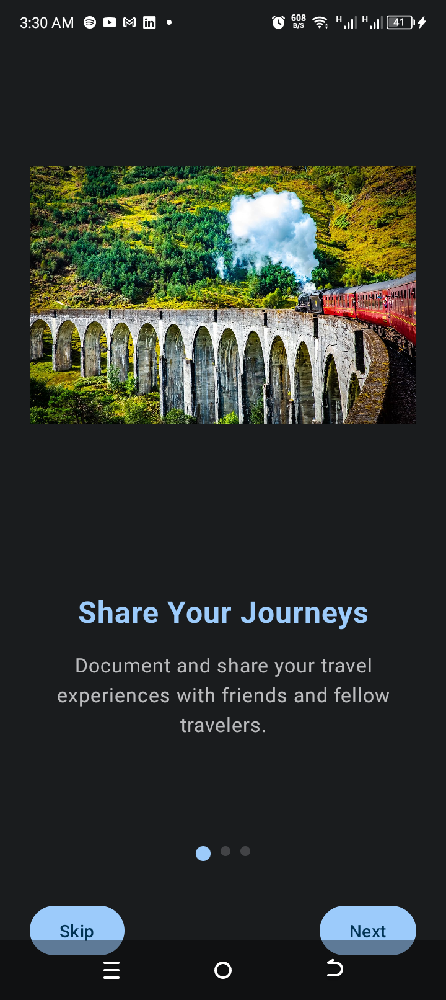
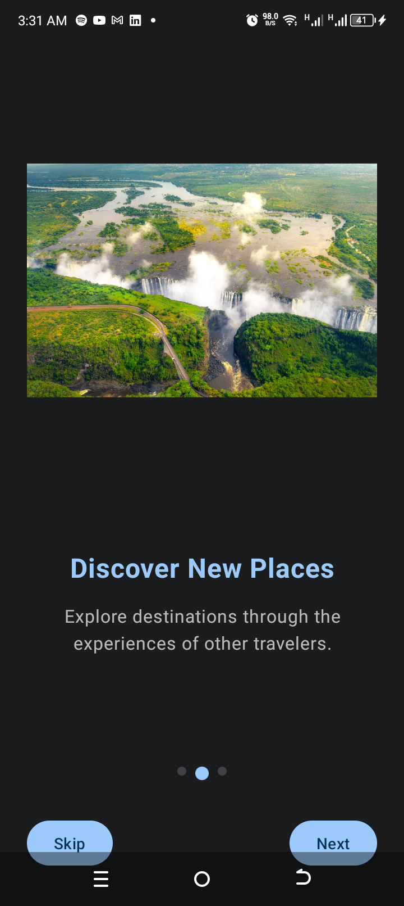
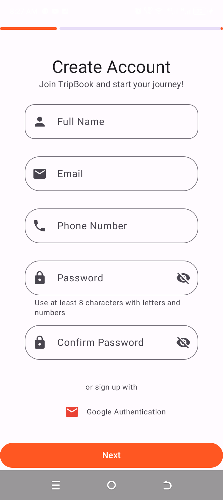
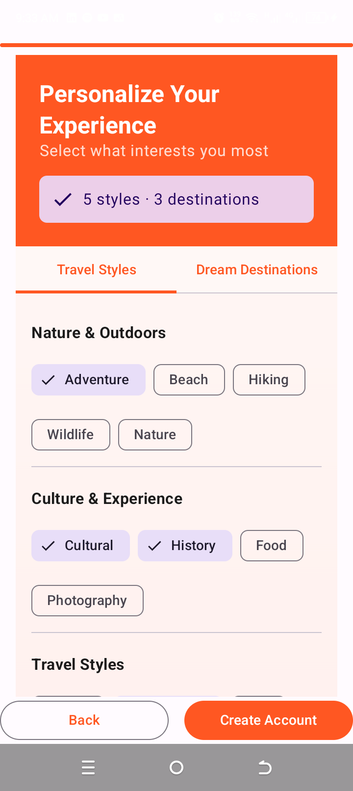
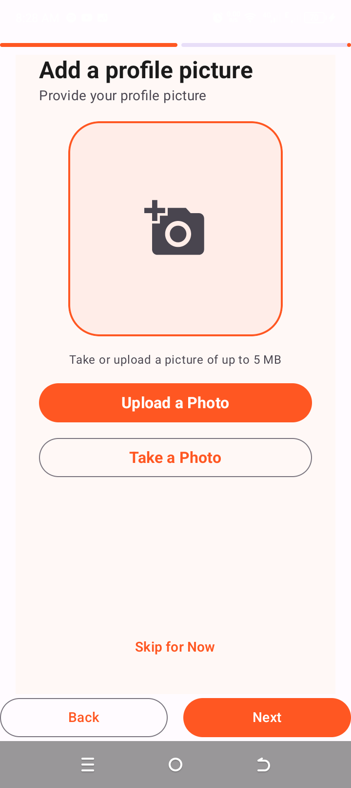

<!-- Improved compatibility of back to top link: See: https://github.com/othneildrew/Best-README-Template/pull/73 -->
<a id="readme-top"></a>
<!--
*** Thanks for checking out the Best-README-Template. If you have a suggestion
*** that would make this better, please fork the repo and create a pull request
*** or simply open an issue with the tag "enhancement".
*** Don't forget to give the project a star!
*** Thanks again! Now go create something AMAZING! :D
-->


<!-- PROJECT SHIELDS -->
<!--
*** I'm using markdown "reference style" links for readability.
*** Reference links are enclosed in brackets [ ] instead of parentheses ( ).
*** See the bottom of this document for the declaration of the reference variables
*** for contributors-url, forks-url, etc. This is an optional, concise syntax you may use.
*** https://www.markdownguide.org/basic-syntax/#reference-style-links
-->
[](https://github.com/sas-bergson/TripBook/graphs/contributors)
[](https://github.com/sas-bergson/TripBook/network/members)
[](https://github.com/sas-bergson/TripBook/stargazers)
[](https://github.com/sas-bergson/TripBook/issues)
[](https://github.com/sas-bergson/TripBook/blob/main/LICENCE)
[](https://linkedin.com/in/your-linkedin)


<!-- PROJECT LOGO -->
<br />
<div align="center">
  <a href="https://github.com/sas-bergson/TripBook">
    
  </a>

  <h3 align="center">TripBook</h3>

  <p align="center">
    A mobile social network for travelers exploring Africa & beyond
    <br />
    <a href="https://github.com/sas-bergson/TripBook"><strong>Explore the docs »</strong></a>
    <br />
    <br />
    <a href="https://github.com/sas-bergson/TripBook">View Demo</a>
    ·
    <a href="https://github.com/sas-bergson/TripBook/issues/new?labels=bug&template=bug-report---.md">Report Bug</a>
    ·
    <a href="https://github.com/sas-bergson/TripBook/issues/new?labels=enhancement&template=feature-request---.md">Request Feature</a>
  </p>
</div>


<!-- TABLE OF CONTENTS -->
<details>
  <summary>Table of Contents</summary>
  <ol>
    <li>
      <a href="#about-the-project">About The Project</a>
      <ul>
        <li><a href="#built-with">Built With</a></li>
      </ul>
    </li>
    <li>
      <a href="#core-modules">Core Modules</a>
      <ul>
        <li><a href="#user-profile">User Profile</a></li>
        <li><a href="#trip-catalog">Trip Catalog</a></li>
        <li><a href="#company-catalog">Company Catalog</a></li>
        <li><a href="#reservation">Reservation</a></li>
        <li><a href="#trip-scheduling">Trip Scheduling</a></li>
        <li><a href="#posts-and-comments">Posts and Comments</a></li>
        <li><a href="#data-mining">Data Mining</a></li>
      </ul>
    </li>
    <li>
      <a href="#getting-started">Getting Started</a>
      <ul>
        <li><a href="#prerequisites">Prerequisites</a></li>
        <li><a href="#installation">Installation</a></li>
      </ul>
    </li>
    <li><a href="#usage">Usage</a></li>
    <li><a href="#roadmap">Roadmap</a></li>
    <li><a href="#contributing">Contributing</a></li>
    <li><a href="#license">License</a></li>
    <li><a href="#contact">Contact</a></li>
    <li><a href="#acknowledgments">Acknowledgments</a></li>
  </ol>
</details>


<!-- ABOUT THE PROJECT -->
## About The Project

## 📱 Screenshots

| Home | Discover | Profile |
|:----:|:--------:|:-------:|
|  |  |  |
| **Your Account** | **Your Style** | **Upload Picture** |
|  |  |  |

TripBook is a mobile social network designed specifically for travelers exploring Africa and beyond. It serves as a comprehensive platform where travelers can share their experiences, connect with fellow adventurers, and access valuable information about destinations.

Key features include:
* Share travel stories, photos, and tips with a community of like-minded travelers
* Rate and review travel agencies and services to help others make informed decisions
* Discover hidden gems and off-the-beaten-path destinations through community recommendations
* Connect with other travelers for advice, companionship, or shared experiences
* Access geolocation-based services to enhance your travel experience
* Promote sustainable tourism and cultural appreciation across Africa and beyond

TripBook aims to create a vibrant community that not only enhances individual travel experiences but also contributes to the growth of tourism in underrepresented regions, particularly across the African continent.

<p align="right">(<a href="#readme-top">back to top</a>)</p>


### Built With

TripBook is built using modern mobile development technologies and frameworks:

* [![Kotlin][Kotlin]][Kotlin-url]
* [![Jetpack Compose][Jetpack-Compose]][Jetpack-Compose-url]
* [![Android][Android]][Android-url]
* [![Material Design][Material-Design]][Material-Design-url]
* [![Firebase][Firebase]][Firebase-url]
* [![Google Maps][Google-Maps]][Google-Maps-url]

<p align="right">(<a href="#readme-top">back to top</a>)</p>


<!-- CORE MODULES -->
## Core Modules

TripBook is organized into several core modules, each handling specific functionality within the application.

### User Profile

The User Profile module manages all aspects of user identity and personalization:

* User registration and authentication (email, social media integration)
* Profile creation and management (personal details, travel preferences, interests)
* Travel history tracking and visualization
* Privacy settings and account management
* User connections and social networking features
* Achievement badges and traveler reputation system

This module serves as the foundation for the social aspects of the platform, allowing users to build their travel identity and connect with others.

### Trip Catalog

The Trip Catalog module provides comprehensive information about travel destinations:

* Curated destination listings with detailed information
* Categorization by region, country, city, and points of interest
* Rich media content including photos, videos, and 360° views
* Cultural information, local customs, and practical travel tips
* Weather data and best times to visit
* Safety information and travel advisories
* Accessibility information for travelers with disabilities

This module helps users discover and learn about potential travel destinations, with a special focus on showcasing African locations.

### Company Catalog

The Company Catalog module connects travelers with service providers:

* Comprehensive listings of travel agencies, tour operators, and guides
* Accommodation options (hotels, hostels, homestays, etc.)
* Transportation services (airlines, car rentals, local transport)
* Activity providers (tours, experiences, adventures)
* Verified business profiles with contact information
* Integration with reservation and booking systems
* Rating and review system for quality assurance

This module helps travelers find reliable services while providing visibility for local businesses.

### Reservation

The Reservation module handles all booking-related functionality:

* Seamless booking interface for accommodations, tours, and activities
* Secure payment processing with multiple currency support
* Reservation management (view, modify, cancel)
* Confirmation and reminder notifications
* Digital ticket and voucher storage
* Booking history and expense tracking
* Integration with external booking platforms when necessary

This module streamlines the booking process, making it easy for users to plan and organize their trips.

### Trip Scheduling

The Trip Scheduling module helps users plan and organize their travel itineraries:

* Interactive trip planning tools with drag-and-drop functionality
* Day-by-day itinerary creation and management
* Time and distance calculations between destinations
* Budget planning and expense tracking
* Collaborative planning for group trips
* Itinerary sharing and export options
* Integration with calendar apps and reminder systems
* Offline access to itineraries during travel

This module transforms travel ideas into concrete plans, helping users maximize their travel experience.

### Posts and Comments

The Posts and Comments module powers the social sharing aspects of the platform:

* Creation and sharing of travel stories, experiences, and tips
* Rich media support for photos, videos, and audio
* Location tagging and mapping of travel experiences
* Interactive commenting and discussion system
* Content categorization and searchability
* Content moderation and reporting system
* Social sharing to external platforms
* Analytics for content creators

This module creates a vibrant community where travelers can share knowledge and inspiration.

### Data Mining

The Data Mining module leverages user data to enhance the platform experience:

* Personalized recommendations based on user preferences and behavior
* Trend analysis for popular destinations and activities
* Sentiment analysis from reviews and comments
* Predictive analytics for travel planning (best times to book, visit, etc.)
* Anonymized data collection for tourism research and development
* Pattern recognition for travel behavior and preferences
* Insights for tourism stakeholders and policy makers

This module uses advanced analytics to provide value to both users and the broader tourism ecosystem, while maintaining strict privacy standards.

<p align="right">(<a href="#readme-top">back to top</a>)</p>


<!-- GETTING STARTED -->
## Getting Started

To get a local copy up and running, follow these simple steps.

### Prerequisites

* Android Studio (latest version)
  ```sh
  # Download from https://developer.android.com/studio
  ```
* JDK 11 or higher
* Git

### Installation

1. Clone the repo
   ```sh
   git clone https://github.com/sas-bergson/TripBook.git
   ```
2. Open the project in Android Studio
3. Sync Gradle files
4. Configure your API keys in the appropriate configuration files
5. Build and run the application on an emulator or physical device

<p align="right">(<a href="#readme-top">back to top</a>)</p>


<!-- USAGE EXAMPLES -->
## Usage

TripBook can be used in various ways depending on your travel needs:

* **Before Travel**: Research destinations, connect with experienced travelers, plan itineraries, and book services.
* **During Travel**: Share real-time updates, connect with nearby travelers, access offline maps and guides, and manage reservations.
* **After Travel**: Share experiences, write reviews, maintain connections with fellow travelers, and inspire others.

_For more examples and usage guides, please refer to the [Documentation](https://github.com/sas-bergson/TripBook/wiki)_

<p align="right">(<a href="#readme-top">back to top</a>)</p>


<!-- ROADMAP -->
## Roadmap

- [x] User Authentication System
- [x] Basic Profile Management
- [ ] Trip Catalog Implementation
  - [ ] African Destinations Database
  - [ ] International Destinations Database
- [ ] Company Listings and Reviews
- [ ] Reservation System Integration
- [ ] Social Sharing Features
- [ ] Advanced Trip Planning Tools
- [ ] Offline Functionality
- [ ] Multi-language Support
  - [ ] French
  - [ ] Swahili
  - [ ] Arabic

See the [open issues](https://github.com/sas-bergson/TripBook/issues) for a full list of proposed features and known issues.

<p align="right">(<a href="#readme-top">back to top</a>)</p>


<!-- CONTRIBUTING -->
## Contributing

Contributions are what make the open source community such an amazing place to learn, inspire, and create. Any contributions you make to TripBook are **greatly appreciated**.

If you have a suggestion that would make this better, please fork the repo and create a pull request. You can also simply open an issue with the tag "enhancement".
Don't forget to give the project a star! Thanks again!

1. Fork the Project
2. Create your Feature Branch (`git checkout -b feature/AmazingFeature`)
3. Commit your Changes (`git commit -m 'Add some AmazingFeature'`)
4. Push to the Branch (`git push origin feature/AmazingFeature`)
5. Open a Pull Request

<p align="right">(<a href="#readme-top">back to top</a>)</p>


<!-- LICENSE -->
## License

Distributed under the MIT License. See `LICENCE` for more information.

<p align="right">(<a href="#readme-top">back to top</a>)</p>


<!-- CONTACT -->
## Contact

Bergson - [@your_twitter](https://twitter.com/your_username) - email@example.com

Project Link: [https://github.com/sas-bergson/TripBook](https://github.com/sas-bergson/TripBook)

<p align="right">(<a href="#readme-top">back to top</a>)</p>


<!-- ACKNOWLEDGMENTS -->
## Acknowledgments

* [African Tourism Board](https://africantourismboard.com/)
* [Android Developer Documentation](https://developer.android.com/)
* [Jetpack Compose Documentation](https://developer.android.com/jetpack/compose)
* [Material Design Guidelines](https://material.io/design)
* [Choose an Open Source License](https://choosealicense.com)
* [Img Shields](https://shields.io)
* [GitHub Pages](https://pages.github.com)

<p align="right">(<a href="#readme-top">back to top</a>)</p>


<!-- MARKDOWN LINKS & IMAGES -->
<!-- https://www.markdownguide.org/basic-syntax/#reference-style-links -->
[contributors-shield]: https://img.shields.io/github/contributors/sas-bergson/TripBook.svg?style=for-the-badge
[contributors-url]: https://github.com/sas-bergson/TripBook/graphs/contributors
[forks-shield]: https://img.shields.io/github/forks/sas-bergson/TripBook.svg?style=for-the-badge
[forks-url]: https://github.com/sas-bergson/TripBook/network/members
[stars-shield]: https://img.shields.io/github/stars/sas-bergson/TripBook.svg?style=for-the-badge
[stars-url]: https://github.com/sas-bergson/TripBook/stargazers
[issues-shield]: https://img.shields.io/github/issues/sas-bergson/TripBook.svg?style=for-the-badge
[issues-url]: https://github.com/sas-bergson/TripBook/issues
[license-shield]: https://img.shields.io/badge/License-MIT-yellow.svg?style=for-the-badge
[license-url]: https://github.com/sas-bergson/TripBook/blob/main/LICENCE
[linkedin-shield]: https://img.shields.io/badge/-LinkedIn-black.svg?style=for-the-badge&logo=linkedin&colorB=555
[linkedin-url]: https://linkedin.com/in/your-linkedin
[product-screenshot]: https://images.pexels.com/photos/32099220/pexels-photo-32099220.jpeg?cs=srgb&dl=pexels-unknown_entity-2151399066-32099220.jpg&fm=jpg
[Kotlin]: https://img.shields.io/badge/Kotlin-0095D5?style=for-the-badge&logo=kotlin&logoColor=white
[Kotlin-url]: https://kotlinlang.org/
[Jetpack-Compose]: https://img.shields.io/badge/Jetpack_Compose-4285F4?style=for-the-badge&logo=jetpackcompose&logoColor=white
[Jetpack-Compose-url]: https://developer.android.com/jetpack/compose
[Android]: https://img.shields.io/badge/Android-3DDC84?style=for-the-badge&logo=android&logoColor=white
[Android-url]: https://www.android.com/
[Material-Design]: https://img.shields.io/badge/Material_Design-757575?style=for-the-badge&logo=materialdesign&logoColor=white
[Material-Design-url]: https://material.io/
[Firebase]: https://img.shields.io/badge/Firebase-FFCA28?style=for-the-badge&logo=firebase&logoColor=black
[Firebase-url]: https://firebase.google.com/
[Google-Maps]: https://img.shields.io/badge/Google_Maps-4285F4?style=for-the-badge&logo=googlemaps&logoColor=white
[Google-Maps-url]: https://developers.google.com/maps
