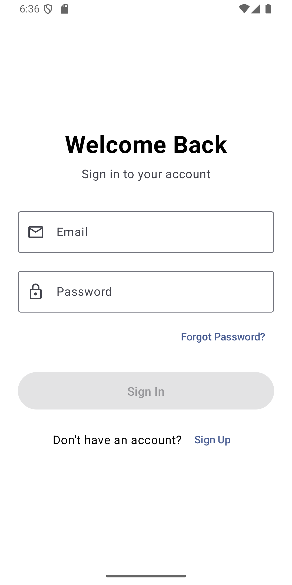
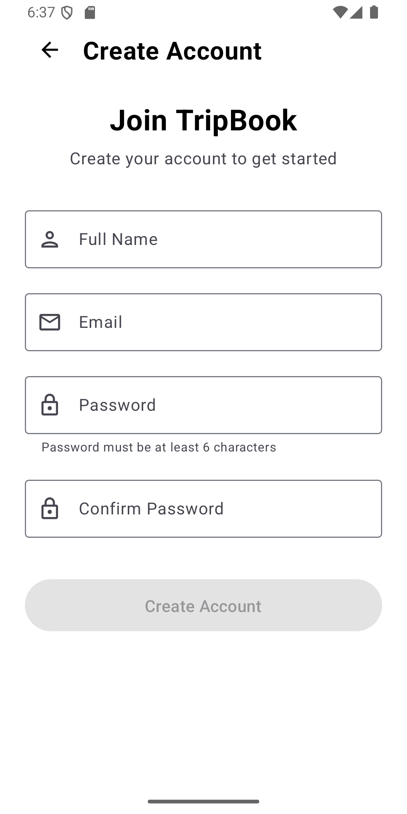
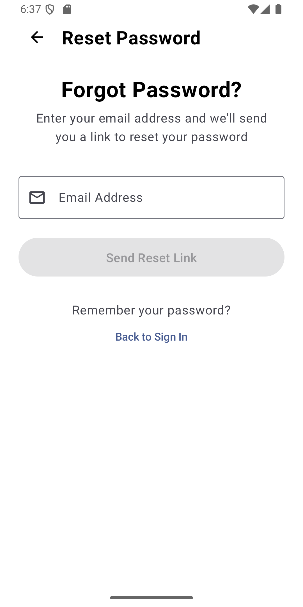
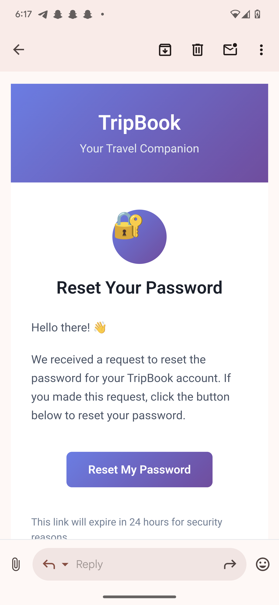

# TripBook - Android App with Complete Password Recovery System

A comprehensive Android authentication system with **real JavaMail email functionality** and modular
architecture featuring multiple team implementations.

## 🎯 Key Features

### ✅ Complete Password Recovery System

- **Real Email Sending** - JavaMail integration with SMTP
- **6-Digit OTP Verification** - Time-based security codes
- **Professional Email Templates** - Beautiful HTML email design
- **10-Minute Expiration** - Secure token lifecycle
- **Password Strength Validation** - Enforced security requirements

### ✅ Multiple Team Implementations

- **userprofilesunjo** - 🆕 Complete password recovery with JavaMail
- **userprofilendedilan** - Registration and basic auth flow
- **userprofileManfoIngrid** - User profile management
- **passwordrecoverysunjo** - Dedicated password recovery module

### ✅ Modern Architecture

- **Clean Architecture** - Domain/Data/Presentation layers
- **MVVM with Compose** - Reactive UI state management
- **Material Design 3** - Latest Android design system
- **Modular Structure** - Independent team modules

## 🚀 Quick Start

### 1. Clone and Build

```bash
git clone <repository-url>
cd Sunjo
./gradlew :app:assembleDebug
```

### 2. Test Password Recovery

```bash
# Run the app
./gradlew :app:installDebug

# Navigate to:
# Login → "Forgot Password?" → Enter real email → Check inbox
```

## 📧 Password Recovery Demo

### Email Configuration

- **SMTP Server**: Gmail (smtp.gmail.com:587)
- **Authentication**: App-specific password
- **Security**: TLS encryption

### Demo Flow

1. **Enter Email** - Any valid email address
2. **Receive Code** - Check inbox for 6-digit OTP
3. **Verify Code** - Enter received code (expires in 10 minutes)
4. **Reset Password** - Set new password with requirements:
    - Minimum 8 characters
    - Uppercase & lowercase letters
    - At least one number
    - At least one special character

## 📁 Project Structure

```
Sunjo/
├── app/                          # Main Android application
│   ├── src/main/java/com/android/tripbook/
│   │   └── auth/                # Authentication screens
│   └── build.gradle.kts         # App dependencies with JavaMail
├── userprofile/                  # User profile module
│   ├── src/main/java/com/tripbook/
│   │   ├── userprofilesunjo/    # 🆕 Password recovery system
│   │   │   ├── data/            # Repository implementation
│   │   │   ├── domain/          # Use cases and models
│   │   │   ├── presentation/    # Compose UI screens
│   │   │   └── util/            # OTP storage utility
│   │   ├── userprofilendedilan/ # Registration system
│   │   └── userprofileManfoIngrid/ # Profile management
│   └── build.gradle.kts         # JavaMail dependencies
├── passwordrecovery/             # Dedicated password recovery
│   └── src/main/java/com/tripbook/passwordrecoverysunjo/
└── backend/                      # Node.js email server (alternative)
```

## 🎮 How to Use

### UserProfile Sunjo Password Recovery

```kotlin
// Navigation integration
UserProfileSunjoEntryPoint()

// Or specific screen
ForgotPasswordScreen(navController)
```

### Email Integration Details

```kotlin
// Real email sending via JavaMail
private suspend fun sendPasswordResetEmail(email: String): Boolean {
    val otp = (100000..999999).random().toString()
    OtpStorage.storeOtp(email, otp)
    
    // Send professional HTML email with OTP
    // Returns true if sent successfully
}
```

## 🛠️ Tech Stack

### Android Frontend

- **Kotlin** - Modern Android development
- **Jetpack Compose** - Declarative UI
- **Material Design 3** - Latest design system
- **Navigation Compose** - Screen navigation
- **MVVM Architecture** - Clean separation

### Email Integration

- **JavaMail API** - Real email sending
- **Gmail SMTP** - Reliable delivery
- **HTML Templates** - Professional design
- **OTP Security** - Time-based verification

### Backend Alternative

- **Node.js + Nodemailer** - Alternative email solution
- **Express API** - RESTful endpoints
- **CORS Support** - Cross-origin requests

## 📧 Email Template Preview

```html
🔐 TripBook Password Reset

Hello,

You requested to reset your password for your TripBook account. 
Use the verification code below:

┌─────────────────────────┐
│       123456            │  
└─────────────────────────┘

⏰ This code will expire in 10 minutes.

🛡️ Security Note: Never share this code with anyone.
```

## 🔧 Configuration

### JavaMail Setup (Production)

```kotlin
// Replace with your SMTP credentials
val session = Session.getInstance(properties, object : Authenticator() {
    override fun getPasswordAuthentication(): PasswordAuthentication {
        return PasswordAuthentication("your-email@gmail.com", "your-app-password")
    }
})
```

### Build Configuration

```kotlin
// app/build.gradle.kts
packaging {
    resources {
        excludes += "/META-INF/{AL2.0,LGPL2.1}"
        excludes += "/META-INF/NOTICE.md"
        excludes += "/META-INF/LICENSE.md"
        pickFirsts += "META-INF/NOTICE.md"
        pickFirsts += "META-INF/LICENSE.md"
    }
}

dependencies {
    implementation("com.sun.mail:android-mail:1.6.7")
    implementation("com.sun.mail:android-activation:1.6.7")
}
```

## 📚 Documentation

- **[UserProfile Sunjo README](userprofile/src/main/java/com/tripbook/userprofilesunjo/README.md)
  ** - Detailed implementation guide
- **[NODEMAILER_SETUP.md](NODEMAILER_SETUP.md)** - Backend email setup
- **[FIREBASE_EMAIL_SETUP.md](FIREBASE_EMAIL_SETUP.md)** - Firebase alternative
- **[AUTH_SYSTEM_README.md](AUTH_SYSTEM_README.md)** - General auth documentation

## 🚀 Team Implementations

### userprofilesunjo (Latest)

- ✅ Complete password recovery system
- ✅ Real JavaMail email integration
- ✅ Modern Material 3 UI
- ✅ Clean architecture implementation
- ✅ Professional email templates

### userprofilendedilan

- ✅ User registration flow
- ✅ Basic authentication
- ✅ Onboarding screens

### userprofileManfoIngrid

- ✅ User profile management
- ✅ Profile picture handling
- ✅ User data management

### passwordrecoverysunjo

- ✅ Dedicated recovery module
- ✅ Alternative implementation
- ✅ Modular architecture

## 🐛 Common Issues & Solutions

### Build Issues

```bash
# META-INF conflicts resolved in build.gradle.kts
# JavaMail dependencies properly configured
# Packaging exclusions added for smooth builds
```

### Email Issues

```bash
# Use Gmail app passwords (not account password)
# Enable 2FA on Gmail account first
# Check SMTP settings: smtp.gmail.com:587
# Verify TLS/STARTTLS configuration
```

## 📊 Current Status

**✅ Password Recovery:** Fully functional with real email sending  
**✅ JavaMail Integration:** Production-ready SMTP configuration  
**✅ UI/UX:** Modern Material 3 design with smooth animations  
**✅ Architecture:** Clean, testable, and maintainable code  
**✅ Security:** OTP expiration, password validation, secure storage  
**✅ Documentation:** Comprehensive guides and README files

## 📱 Screenshots

### Password Recovery Flow

<div align="center">
  
  
  
</div>

### Email Examples

<div align="center">
  
</div>

---

**Latest Update**: Added complete password recovery system with JavaMail integration in
`userprofilesunjo` package.  
**Next Steps**: Deploy to production with cloud email service integration.
