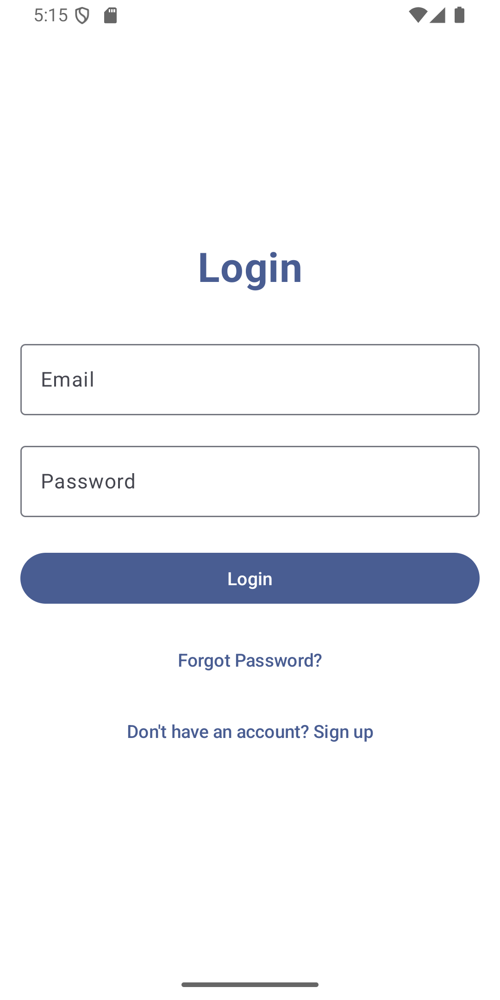
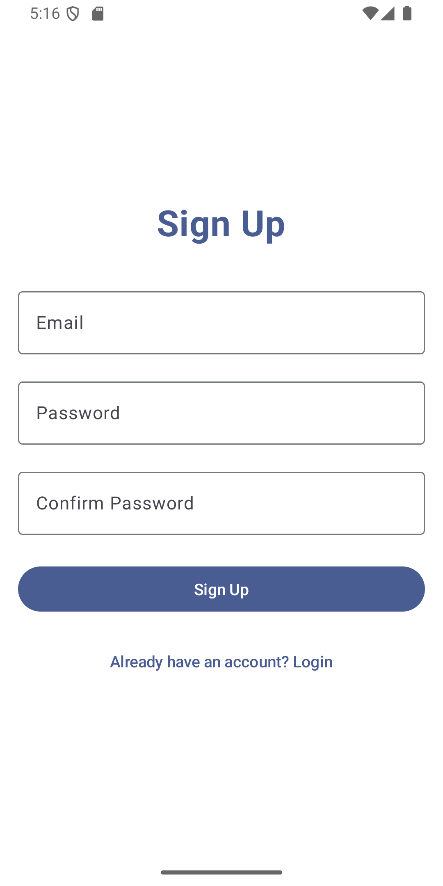
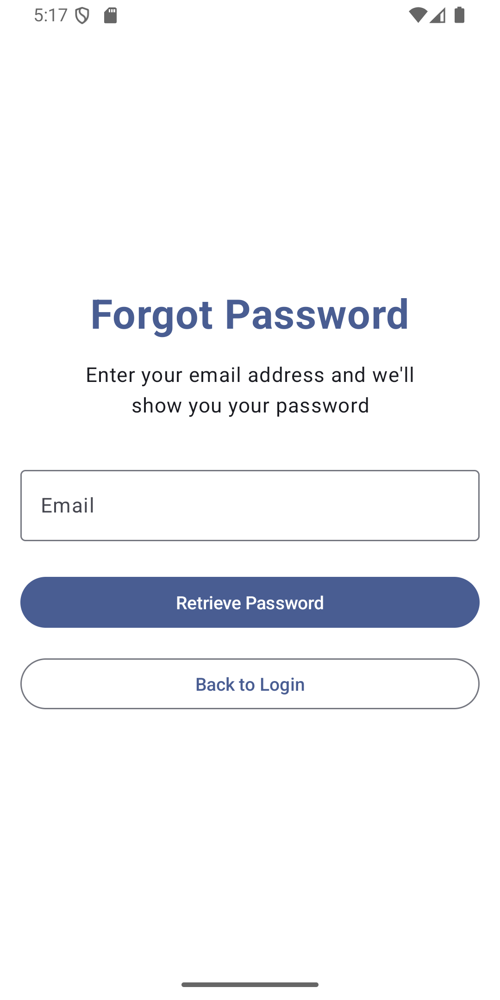

# TripBook 🌍✨

**TripBook** is a mobile social network for travelers exploring Africa & beyond. Share stories,
photos, and tips, rate travel agencies, and connect with adventurers. A community-driven platform to
discover hidden gems, promote tourism, and ensure safer journeys.

## 🚀 Features

### Authentication System

- **User Registration** - Sign up with email and password
- **User Login** - Secure authentication with SQLite database
- **Forgot Password** - Password recovery functionality
- **Input Validation** - Email format and password strength validation

### Travel Social Network (Coming Soon)

- Share travel stories and photos
- Rate and review travel agencies
- Connect with fellow adventurers
- Discover hidden gems and destinations
- Community-driven travel tips and recommendations

## 📱 Screenshots

<div align="center">
  
  
  
</div>

<p align="center">
  <em>Login Screen • Sign Up Screen • Forgot Password Screen</em>
</p>

> **Note**: To add your screenshots, create a `screenshots` folder in your project root and add your
> PNG/JPG images there.

## 🛠 Tech Stack

- **Frontend**: Android (Kotlin + Jetpack Compose)
- **Database**: SQLite
- **UI Framework**: Material Design 3
- **Architecture**: MVVM with state management

## 📱 Getting Started

### Prerequisites

- Android Studio
- Android SDK (API level 31+)
- Kotlin 1.9.0+

### Installation

1. Clone the repository

```bash
git clone https://github.com/yourusername/tripbook.git
cd tripbook
```

2. Open the project in Android Studio

3. Build and run the project

```bash
./gradlew build
./gradlew installDebug
```

### Usage

1. **First Time Users**:
    - Launch the app
    - Tap "Sign Up" to create a new account
    - Enter your email and password
    - Confirm your password and register

2. **Returning Users**:
    - Enter your email and password
    - Tap "Login" to access the app

3. **Forgot Password**:
    - Tap "Forgot Password?" on login screen
    - Enter your email to retrieve your password

## 📂 Project Structure

```
app/src/main/java/com/android/tripbook/
├── MainActivity.kt          # Main activity with navigation
├── User.kt                 # User data model
├── DatabaseHelper.kt       # SQLite database operations
├── LoginScreen.kt          # Login UI screen
├── SignupScreen.kt         # Registration UI screen
├── ForgotPasswordScreen.kt # Password recovery screen
├── HomeScreen.kt           # Welcome/dashboard screen
└── ui/theme/               # App theming
```

## 🔧 Configuration

The app uses SQLite for local data storage with the following user table structure:

```sql
CREATE TABLE users (
    id INTEGER PRIMARY KEY AUTOINCREMENT,
    email TEXT UNIQUE NOT NULL,
    password TEXT NOT NULL
);
```

## 🤝 Contributing

Contributions are welcome! Please feel free to submit a Pull Request.

1. Fork the project
2. Create your feature branch (`git checkout -b feature/AmazingFeature`)
3. Commit your changes (`git commit -m 'Add some AmazingFeature'`)
4. Push to the branch (`git push origin feature/AmazingFeature`)
5. Open a Pull Request

## 📝 Development Roadmap

- [x] User authentication system
- [x] SQLite database integration
- [x] Material Design UI


## 📄 License

This project is licensed under the MIT License - see the [LICENSE](LICENSE) file for details.

## 📞 Support

For support and questions, please open an issue on GitHub or contact the development team.

---

**Built with ❤️ for travelers exploring Africa & beyond**
