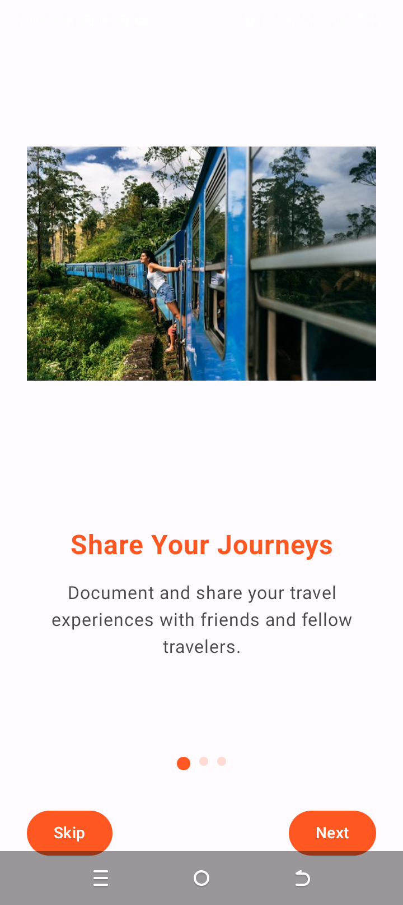
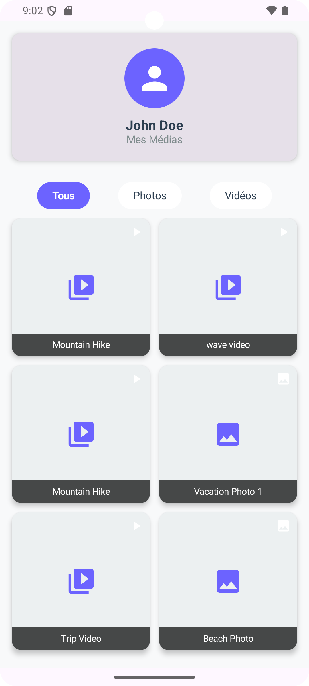
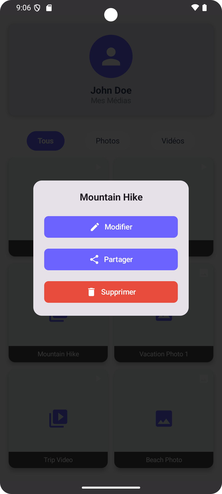

# TripBook
TripBook: A mobile social network for travelers exploring Africa &amp; beyond. Share stories, photos, and tips, rate travel agencies, and connect with adventurers. Community-driven platform to discover hidden gems, promote tourism, and ensure safer journeys.  Contributions welcome! 🌍✨_

---

## 🚀 Principal Functionality

- **Share experiences**: Publish your travel stories, photos, and advice.
- **Discovery**: Explore new destinations through others' experiences.
- **Connection**: Meet travelers with similar interests and plan together.
- **Evaluation**: Rate travel agencies to help the community.
- **Security**: Access reliable information for peaceful journeys.
---

## 📱 Screenshots

|                                           Home                                            |                                      Discover                                      |                                      Profile                                      |
|:-----------------------------------------------------------------------------------------:|:----------------------------------------------------------------------------------:|:---------------------------------------------------------------------------------:|
|               |    |    |
|                                     **Your Account**                                      |                                   **Your Style**                                   |                                **Upload Picture**                                 |
|          |      |  |
|                                    **mediamanagement**                                    |                                    **actions**                                     |                                  **mediashare**                                   |
|                |                 |  |
---

## 🛠️ Stack technique

- **Android (Kotlin, Jetpack Compose)**
- **Navigation Compose**
- **DataStore Preferences**
- **Material 3**
- **Backend** : Node.js (API REST)
- **Géolocalisation** : APIs de localisation

---

## 📦 Installation

1. **Clone the repo :**
   ```bash
   git clone https://github.com/sas-bergson/TripBook.git

   Open in Android Studio
   Lancer l’application sur un émulateur ou un appareil physique

<hr></hr>
🤝 Contribute
Contributions are welcome! Please open an issue or a pull request for any suggestions or improvements.
<hr></hr>
👨‍💻 Author
Eng Daniel Moune (alias sas-bergson)   
Lecturer Android Mobile App,   
ICT University, Spring 2025 GitHub  <hr></hr>
🌍 Licence
Ce projet est sous licence MIT.
