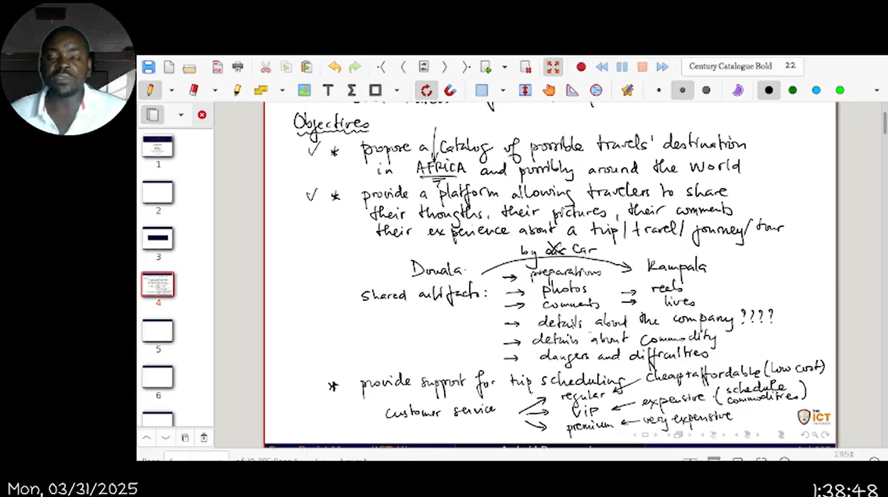

# TripBook 🌍✈️

[](https://www.android.com)
[](https://kotlinlang.org)
[](LICENSE)

## Overview

TripBook is a social network mobile application designed for travelers exploring Africa and beyond. It provides a community-driven platform where travelers can share experiences, photographs, travel tips, and rate travel agencies. The app helps users discover hidden gems, connect with fellow adventurers, promote tourism, and ensure safer journeys through community feedback.



## Features

- **User Authentication**: Secure login and registration with email or social media accounts
- **Personalized Landing Page**: Attractive introduction to the app with featured destinations
- **Discovery Feed**: Browse origin-destination pairs and view recent traveler posts
- **Content Management**: Create, edit, view, and delete travel posts with images and location data
- **Post Details**: View detailed posts with image galleries, location information, and comments
- **User Profiles**: View all posts made by specific users with filtering options
- **Travel Agency Ratings**: Rate and review travel agencies based on experiences
- **Geolocation Integration**: Location-based recommendations and mapping features
- **Offline Mode**: View previously loaded content without internet connection

## Screenshots

<table>
  <tr>
    <td></td>
    <td></td>
    <td></td>
    <td></td>
  </tr>
</table>

## Architecture

TripBook is built using the MVVM (Model-View-ViewModel) architectural pattern for better separation of concerns and testability. The app follows a modular approach with these key components:

- **Presentation Layer**: UI components, ViewModels, and adapters
- **Business Layer**: Use cases and service interfaces
- **Data Layer**: Repositories, data sources, and models
- **Infrastructure Layer**: Network utilities and authentication

For more details, see the [Software Design Document](doc/SDD.md).

## Technologies

- **Kotlin**: Primary programming language
- **Jetpack Components**: ViewModel, LiveData, Room, Navigation
- **Material Design**: Modern UI/UX patterns
- **Retrofit & OkHttp**: Network communication
- **Room Database**: Local data persistence
- **Glide/Coil**: Image loading and caching
- **Google Maps API**: Location features
- **Hilt/Koin**: Dependency injection

## Getting Started

### Prerequisites

- Android Studio Arctic Fox or newer
- JDK 11+
- Android SDK 21+
- Kotlin 1.5+

### Installation

1. Clone the repository:
   ```bash
   git clone https://github.com/yourusername/TripBook.git
   ```

2. Open the project in Android Studio

3. Sync Gradle files

4. Run the app on an emulator or physical device

For detailed implementation guidelines, see the [Implementation Guidelines](doc/Implementation.md).

## Project Structure

```
app/
├── src/
│   ├── main/
│   │   ├── java/com/android/tripbook/
│   │   │   ├── auth/            # Authentication module
│   │   │   ├── landing/         # Landing page module
│   │   │   ├── discovery/       # Discovery feed module
│   │   │   ├── content/         # Content management module
│   │   │   ├── postview/        # Post view module
│   │   │   ├── userprofile/     # User posts module
│   │   │   ├── data/            # Data models and repositories
│   │   │   ├── network/         # API clients and services
│   │   │   └── utils/           # Utility classes
│   │   ├── res/                 # Resources (layouts, drawables, etc.)
│   │   └── AndroidManifest.xml
│   ├── test/                    # Unit tests
│   └── androidTest/             # Instrumentation tests
├── build.gradle.kts
└── proguard-rules.pro
```

## User Flow

1. User enters the app and lands on the welcome page
2. User registers or logs in (session lasts for 7 days)
3. User navigates to the discovery page to browse travel destinations and posts
4. User can create, edit, view, and delete their own travel posts
5. User can view detailed information about selected posts
6. User can browse posts made by specific users

## Documentation

- [Software Requirements Specification (SRS)](doc/SRS.md)
- [Software Design Document (SDD)](doc/SDD.md)
- [Implementation Guidelines](doc/Implementation.md)

## Contributing

We welcome contributions to TripBook! Please feel free to submit pull requests, report bugs, and suggest features.

1. Fork the repository
2. Create your feature branch: `git checkout -b feature/amazing-feature`
3. Commit your changes: `git commit -m 'Add some amazing feature'`
4. Push to the branch: `git push origin feature/amazing-feature`
5. Open a pull request

## License

This project is licensed under the MIT License - see the [LICENSE](LICENSE) file for details.

## Contact

Project Lead - [Your Name](mailto:your.email@example.com)

Project Repository: [https://github.com/yourusername/TripBook](https://github.com/yourusername/TripBook)