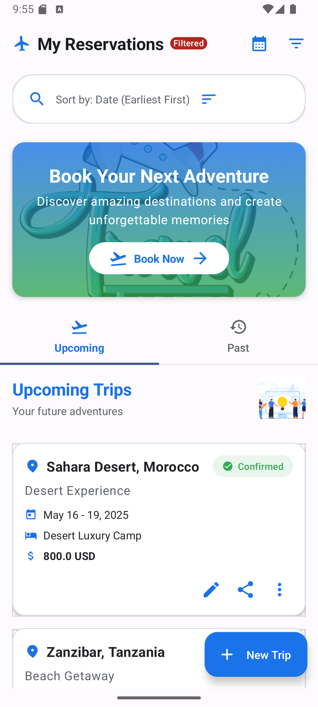

# TripBook Reservation Dashboard

**By: Ngana Noa Junior Frederic**

## Overview

The Reservation Dashboard is a core feature of the TripBook application, providing users with a comprehensive interface to manage their travel reservations. This module enables users to view, filter, sort, and manage their upcoming and past trips in both list and calendar views.

## Features Implemented

### 1. Dashboard UI
- **Modern UI Design**: Implemented a visually appealing interface with purple and orange color scheme
- **Responsive Layout**: Adapts to different screen sizes and orientations
- **Animated Components**: Added subtle animations for enhanced user experience
- **Welcome Banner**: Displays a personalized greeting with travel illustration

### 2. Reservation Management
- **Reservation List**: Displays all reservations with key information
- **Reservation Details**: Detailed view of each reservation
- **Add New Reservation**: Multi-step form with validation for creating new reservations
- **Edit Reservation**: Interface for modifying existing reservations
- **Delete Reservation**: Ability to remove unwanted reservations

### 3. Organization & Filtering
- **Tabs**: Separate tabs for upcoming and past reservations
- **Search Functionality**: Search reservations by title, destination, etc.
- **Advanced Filtering**: Filter by status, date range, price, and destination
- **Sorting Options**: Sort by date, price, or alphabetically
- **Status Indicators**: Visual indicators for reservation status (confirmed, pending, cancelled, completed)

### 4. Calendar Integration
- **Calendar View**: Toggle between list and calendar views
- **Month Navigation**: Browse through different months
- **Date Selection**: Select specific dates to view or add reservations
- **Visual Indicators**: Highlight dates with reservations

### 5. UI Components
- **Modernized Filter Dialog**: Card-based sections with collapsible content
- **Step-based Add Reservation Form**: Intuitive multi-step process with progress indicator
- **Status Chips**: Color-coded status indicators with icons
- **Quick Action Buttons**: Easy access to common actions

## Technical Implementation

### Architecture
- **Model-View-ViewModel (MVVM)** architecture pattern
- **Repository Pattern** for data management
- **Compose UI** for modern declarative UI

### Key Technologies
- **Jetpack Compose**: Modern UI toolkit for building native UI
- **Material Design 3**: Latest Material Design components and theming
- **Kotlin Coroutines & Flow**: For asynchronous operations and reactive programming
- **Animation API**: For fluid UI transitions and effects

### UI Components
- Custom animations using `AnimationUtils`
- Reusable components for consistency
- Responsive layouts using `ConstraintLayout` and `BoxWithConstraints`
- Theming with custom color palette

## Design Choices

### Color Scheme
- **Primary Color**: Purple (#6200EE) - Used for primary actions, selected states, and emphasis
- **Secondary Color**: Orange (#FF8800) - Used for accents, highlights, and secondary actions
- **Status Colors**:
  - Confirmed: Purple (#6200EE)
  - Pending: Orange (#FF8800)
  - Cancelled: Red (#EA4335)
  - Completed: Light Purple (#AB47BC)

### Animation Types
- **Slide-in/out**: For page transitions
- **Fade-in/out**: For content changes
- **Spring animations**: For interactive elements
- **Scale/Rotate**: For attention-grabbing elements

### Layout Principles
- **Card-based design**: For clear content separation
- **Consistent spacing**: 8dp, 16dp, and 24dp spacing system
- **Visual hierarchy**: Using size, color, and position to guide attention
- **Accessibility**: Sufficient contrast and touch target sizes

## Future Work

### Short-term Improvements
1. **Offline Support**: Implement local caching for offline access to reservations
2. **Notifications**: Add reminders for upcoming trips
3. **Sharing**: Enable sharing reservation details with others
4. **Export Functionality**: Allow exporting reservation details as PDF or calendar events
5. **Improved Date Picker**: Custom date picker with better UX for selecting date ranges

### Long-term Vision
1. **Integration with Travel APIs**: Connect with flight, hotel, and transportation APIs
2. **AI Recommendations**: Suggest activities based on destination and dates
3. **Trip Planning**: Expand to full trip planning with itineraries
4. **Social Features**: Allow friends to join trips and collaborate on planning
5. **Analytics Dashboard**: Provide insights on travel patterns and spending

## Testing

### Unit Tests
- Repository tests for data operations
- ViewModel tests for business logic
- UI tests for component rendering

### Integration Tests
- End-to-end tests for complete user flows
- Navigation tests between screens

## Getting Started

### Prerequisites
- Android Studio Arctic Fox or newer
- Kotlin 1.5.0 or newer
- Android SDK 31 or newer

### Building and Running
1. Clone the repository
2. Open in Android Studio
3. Sync Gradle files
4. Run on emulator or physical device

## Conclusion

The Reservation Dashboard provides a solid foundation for the TripBook application's reservation management capabilities. With its modern UI, intuitive interactions, and comprehensive feature set, it offers users an efficient way to manage their travel plans. Future enhancements will focus on expanding functionality, improving performance, and integrating with external services to create an even more valuable travel companion.
