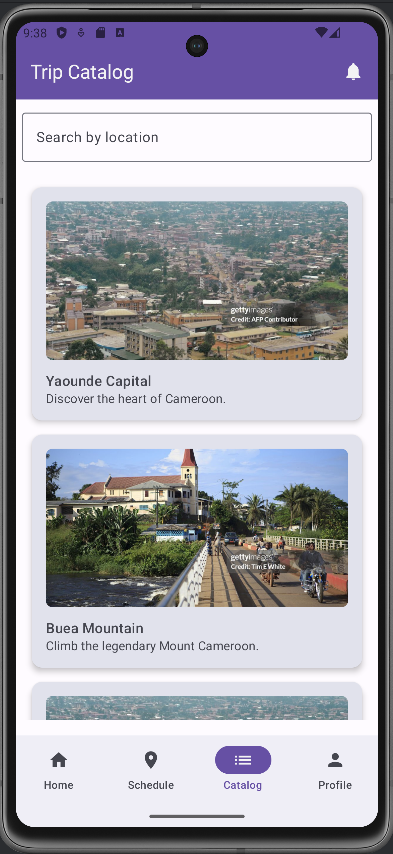
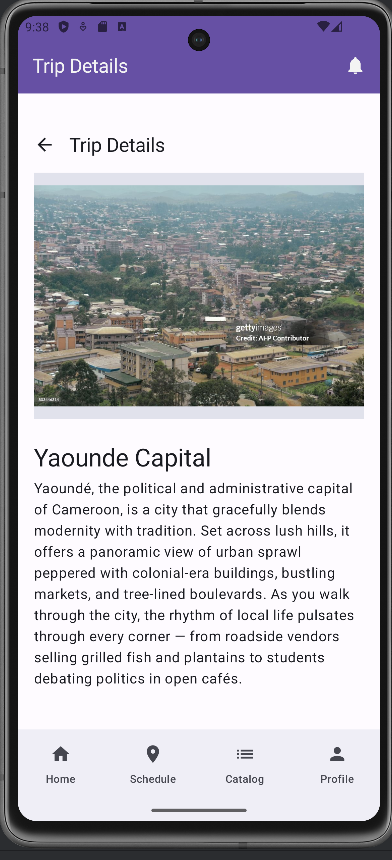
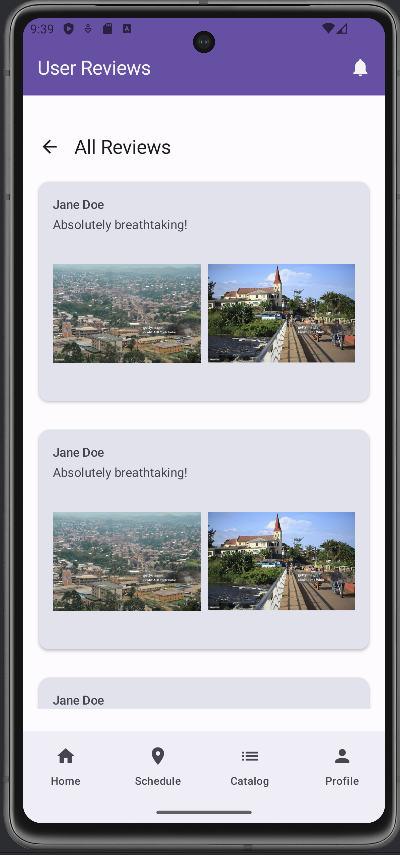

# Trip Catalog Module - TripBook Travel App

## 📘 Introduction

The **Trip Catalog Module** is a core feature of the TripBook Travel mobile application. It provides users with a visually engaging and informative experience where they can explore travel destinations, read authentic user experiences, and contribute their own trip stories and media.

This module is designed to be intuitive and socially interactive. It integrates seamlessly with the overall TripBook app architecture, serving as both a discovery platform for new travel destinations and a space for community engagement.

It will connects with other modules such as:
- The **Trip Scheduling Module** (for converting interest into action)
- The **User Profile Module** (to display and manage user-submitted content)

---

## 🔧 Functionalities Planned

Below is a breakdown of the key features and screens planned for the Trip Catalog module:

### ✅ Core Functionalities
- **Trip Catalog Screen**
    - Displays a list/grid of possible trip destinations.
    - Each item shows a destination name and a representative image along with a short caption
    - Clicking an item navigates to the detailed view

- **Trip Detail Screen**
    - Swipable image carousel at the top
    - Displays trip name and description
    - Shows a preview of 1–5 user reviews (with option to "See All Reviews")
    - Allows users to submit their own reviews directly from this screen

- **Review Section**
    - Each review includes the username(taken from the user information), comment, and optional images
    - Reviews are displayed horizontally (carousel-like)
    - Shows a ``see all`` button to allow for view of more review related to a given trip destination

- **All Reviews Screen**
    - Displays all user-submitted reviews for a selected trip destination
    - Reviews shown vertically with full text and images
    - Long reviews are initially truncated with a “Read More” button to expand

- **Add Review Section**
    - Accessible from the Trip Detail screen
    - Allows users to:
        - Enter a comment
        - Upload images
        - Submit their review tied to the selected trip

---

## ✅ Functionalities Implemented So Far

### 1. **Trip Catalog Screen**
- Fully implemented with sample data
- Each trip card is clickable, routing to its detail screen using navigation with trip ID

### 2. **Trip Detail Screen**
- Fetches full trip data by ID from a sample source
- Displays image carousel and description
- Shows a horizontal list of review cards (username, comment, image)
- Includes a "See All Reviews" button that navigates to the full review screen

### 3. **All Reviews Screen**
- Fetches and displays all reviews for the trip
- Long reviews are collapsed with a “Read More” option
- Built using dynamic layout that scales to review length and image count

### 4. **Navigation Integration**
- All screens are fully integrated into the app’s navigation using the Jetpack Compose NavHost pattern
- Trip ID is passed through the navigation route for fetching dynamic data

### 5. **UI Components**
- Modular UI using reusable Composables (ReviewCard, TripCard, etc.)
- Design consistent with app-wide theming and UX patterns

---

## 📷 Screenshots (To Be Added)
> _Note: Add actual screenshots after UI implementation is complete._

- Trip Catalog Screen  
  

- Trip Detail Screen  ~~~~
  

- Horizontal Review Section  
  

- All Reviews Screen  
  


---

## 🔄 Planned Enhancements
- Advanced filtering/sorting in the catalog screen
- Reaction system (like, comment, flag) for reviews


Perfect. Let's proceed with **Part 2: Code Architecture & Data Flow**, which outlines how the Trip Catalog module is structured and how data flows between components. This will be especially useful for developers maintaining or extending the module.

---

## 🏗️ Code Architecture

The Trip Catalog module follows a clean separation of concerns, leveraging the MVVM (Model-View-ViewModel) architecture and Jetpack Compose for UI.

### 📁 Package Structure

```plaintext
tripcatalog/
├── data/
│   ├── SampleTrips.kt            # Static mock data for trips
│   ├── SampleReviews.kt          # Static mock data for trip reviews
├── model/
│   ├── Trip.kt                   # Data class representing a trip (id, title, description, images, etc.)
│   ├── Review.kt                 # Data class representing a user review (username, content, images, etc.)
├── ui/
│   ├── screens/
│   │   ├── TripCatalogScreen.kt      # Displays a list of trips in a scrollable view
│   │   ├── TripDetailScreen.kt       # Shows detailed info and reviews for a selected trip
│   │   ├── AllReviewsScreen.kt       # Displays all reviews for a trip in a vertical list
│   ├── components/
│   │   ├── BaseScaffold.kt           # Common layout wrapper for screens with consistent structure
│   │   ├── BottomNavBar.kt           # Bottom navigation bar for switching between app sections
│   │   ├── TopBar.kt                 # Top bar component with title and back navigation
│   │   ├── TripCard.kt               # Card UI component showing trip summary (image, title, etc.)
│   │   ├── ReviewCard.kt             # Card UI for displaying an individual user review
│   │   └── ReviewCarousel.kt         # Horizontally scrollable row of review cards
│   ├── navigation/
│   │   ├── MainNavGraph.kt           # Defines navigation graph and composable destinations
│   │   ├── NavigationUtils.kt        # Helper functions for building and handling navigation routes
├── viewmodel/
│   ├── MockTripViewModel.kt          # ViewModel providing trip data from SampleTrips
│   ├── MockReviewViewModel.kt        # ViewModel providing reviews from SampleReviews based on trip ID
````

---

## 🔁 Data Flow

### 📥 Trip Selection Flow

1. **TripCatalogScreen**

    * Displays trips from `SampleTrips`
    * On click, passes the trip ID via navigation route to `TripDetailScreen`

2. **TripDetailScreen**

    * Fetches the corresponding trip data from `SampleTrips` using `tripId`
    * Loads reviews dynamically using `tripId` from `SampleReviews`

3. **AllReviewsScreen**

    * Navigated from TripDetailScreen
    * Loads all reviews for the trip
    * Supports expandable/collapsible long reviews

### 📤 Add Review Flow

1. **User enters review**

    * Comment text and image(s) captured in `AddReviewSection`

2. **Review Submission**

    * Currently updates in-memory list in ViewModel
    * Will be extended to call an API endpoint in the future

3. **Review Update**

    * The new review appears immediately in the carousel and review list

---

## 🧩 Reusable Components

| Component       | Description                                                     |
|-----------------|-----------------------------------------------------------------|
| `TripCard`      | Compact card showing trip image and title                       |
| `ReviewCard`    | Shows reviewer, comment, images (with expandable logic)         |
| `ImageCarousel` | Shows images in a carousel form that you can swipe to view more |


---

## 🧪 Current Testing Approach

Since the data is static and UI-driven:

* Manual UI testing has been the primary method
* Dynamic features like `Read More`, carousel behavior, and navigation transitions have been tested in emulator
* Planned: Add UI tests with Jetpack Compose test APIs once mock backend is integrated


