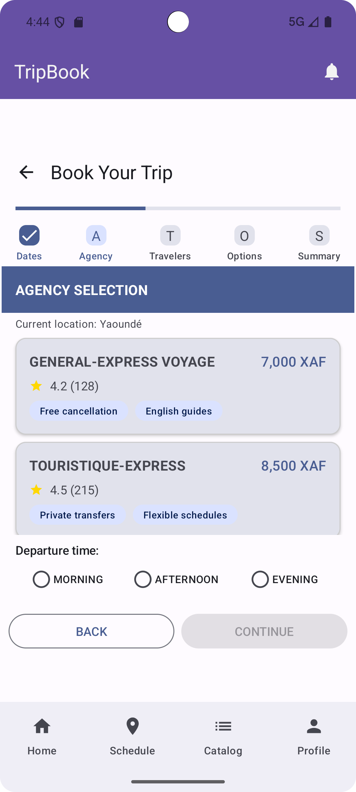
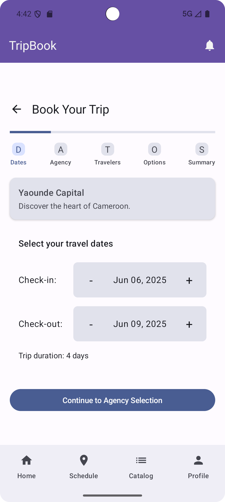
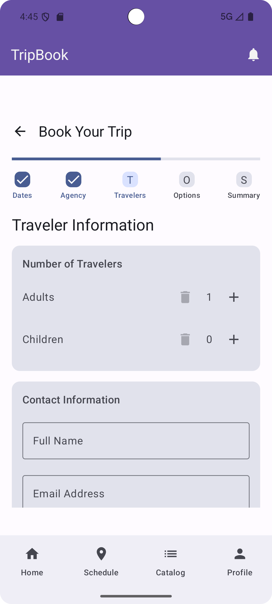

# Trip Catalog Module - TripBook Travel App

## 📘 Introduction
The **Trip Catalog Module** is a key component of the TripBook Travel mobile app.  It offers visitors a visually appealing and educational experience in which they may explore travel destinations, read authentic user experiences, and share their own trip stories and photos.

This module is intended to be intuitive and socially interactive.  It works flawlessly with the TripBook app architecture, acting as both a discovery tool for new travel destinations and a forum for community involvement.


It integrates with other modules, including the **Trip Scheduling Module**, which converts interest into action.
- The **User Profile Module** (displays and manages user-submitted content).

---

## 🔧 Functionalities Planned

Below is a breakdown of the key features and screens planned for the Trip Catalog module:

### ✅ Core Functionalities

- **Booking Process**
    - Display of the booking process with date, Agency, and time for the booking to take place 


---

## ✅ Functionalities Implemented So Far


### 1. **All Agency Screen**
- Fetches and displays all agencies for the trip
- Built using dynamic layout that scales

### 2. **Navigation Integration**
- All screens are fully integrated into the app’s navigation using the Jetpack Compose NavHost pattern
- Agency ID is passed through the navigation route for fetching dynamic data

### 3. **UI Components**
- Modular UI using reusable Composables (AgencyCard, etc.)
- Design consistent with app-wide theming and UX patterns

### 4. **Rating of Agencies and sorting**


---

## 📷 Screenshots

<table>
  <tr>
    <td align="center">
      <strong>Trip Catalog Screen</strong><br>
      
    </td>
  <tr>
    <td align="center">
      <strong>Trip Catalog Screen</strong><br>
      
    </td>
  <tr>
    <td align="center">
      <strong>Trip Catalog Screen</strong><br>
      
    </td>
</table>


Perfect. Let's proceed with **Part 2: Code Architecture & Data Flow**, which outlines how the Trip Catalog module is structured and how data flows between components during the booking process. This will be especially useful for developers maintaining or extending the module.

---

## 🏗️ Code Architecture

The Trip Catalog module follows a clean separation of concerns, leveraging the MVVM (Model-View-ViewModel) architecture and Jetpack Compose for UI.

### 📁 Package Structure

```plaintext
tripcatalog/
├── data/
│   ├── SampleAgency.kt            # Static mock data for agencies
│   
├── model/
│   ├── Agency.kt                   # Data class representing an agency (id, name, description, images, etc.)
│
├── ui/
│   ├── screens/
│   │   ├── booking/     
│   │        ├── AgencySelectionStep.kt       # Displays a list of agencies in a scrollable view
│   │        ├── BookingScreen.kt             # Provides a step by step navigation of the booking process
             ├── DateSelectionStep.kt         # Displays information about the date for the selection process
│   ├── components/
│   │   ├── AgencyCard.kt               # Agency UI component showing agency summary (image, name, etc.)
│   ├── theme/
│   │   ├── Extensions.kt               #  A layout composable with content
├── viewmodel/
│   ├── BookingViewModel.kt          # ViewModel providing agency data from SampleAgency
│ 
````

---

## 🔁 Data Flow

### 📥 Trip Selection Flow

1. **DateSelectionStep**

    * Displays dates 
    * On click, passes the trip ID via navigation route to `AgencySelectionStep`

2. **AgencySelectionStep**

    * Fetches the corresponding agencies data from `SampleAgency` using `AgencyId`
    * Loads agencies dynamically using `AgencyId` from `SampleAgency`

3. **TravelerInfoStep**

    * Navigated from AgencySelectionStep
    * Takes down all information for the trip


## 🧩 Reusable Components

| Component      | Description                                                     |
|----------------|-----------------------------------------------------------------|
| `AgencyCard`   | Compact card showing agency image and name                      |


---

## 🧪 Current Testing Approach

Since the data is static and UI-driven:

* Manual UI testing has been the primary method
* Dynamic features like `Read More`, carousel behavior, and navigation transitions have been tested in emulator
* Planned: Add UI tests with Jetpack Compose test APIs once mock backend is integrated


